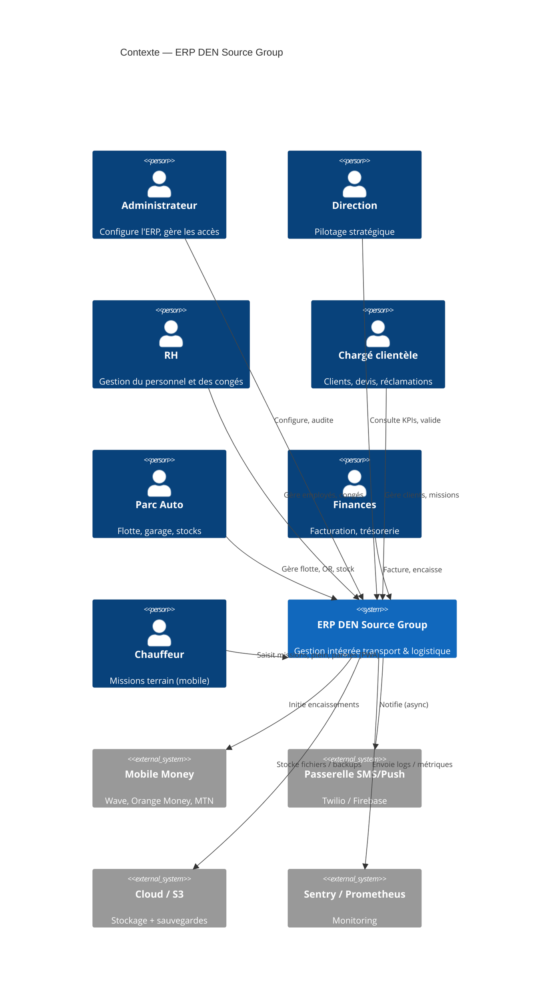
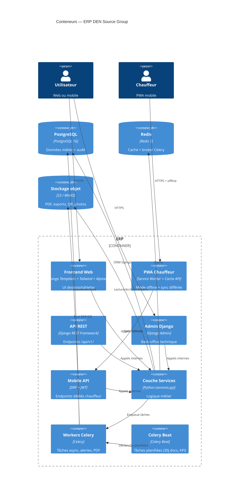
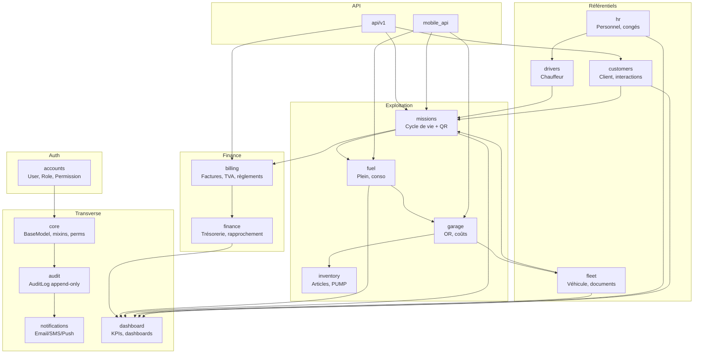
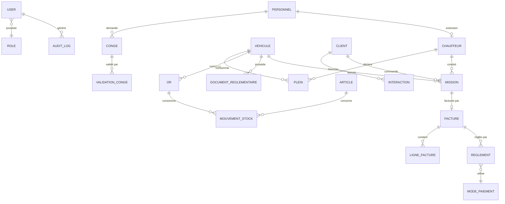
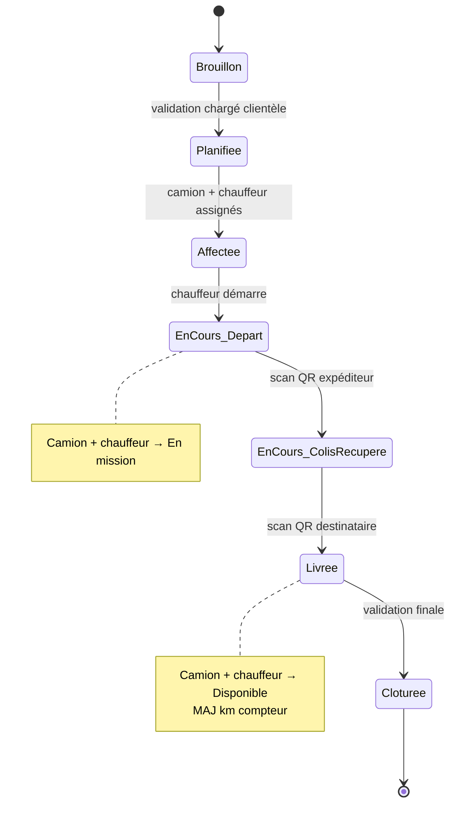
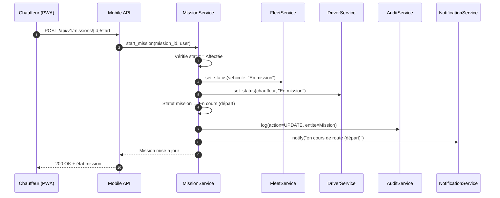
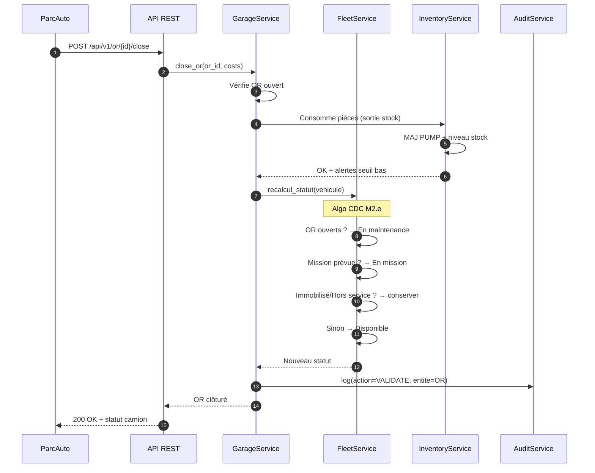
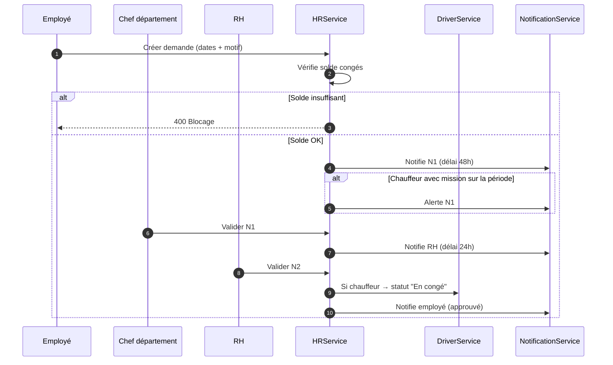
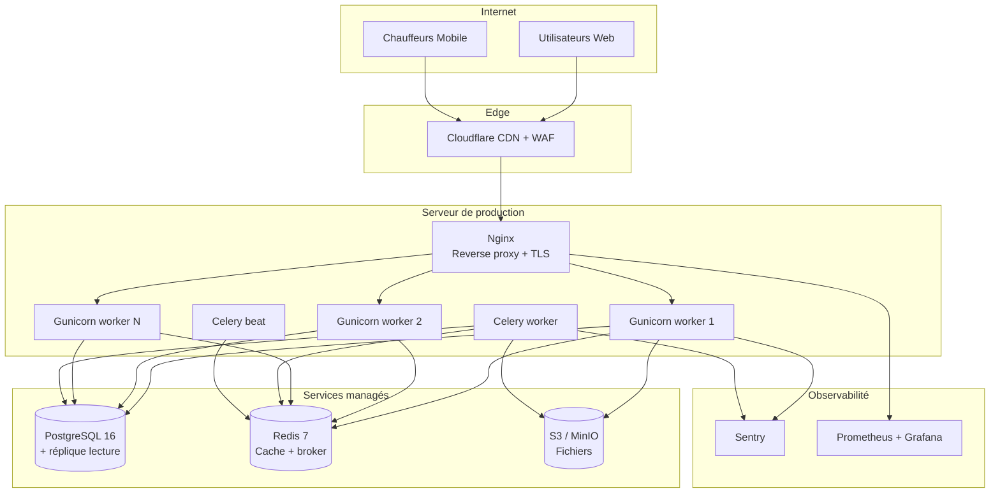
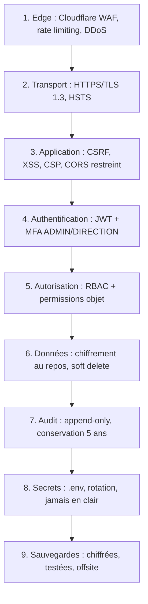

# Architecture Technique — ERP DEN Source Group

> Document d'architecture au format C4 (Context → Containers →
> Components → Code) + vues dynamiques, données, déploiement,
> sécurité, observabilité.

---

## 1. VUE CONTEXTE (C4 Niveau 1)

Qui utilise le système, et avec quels systèmes externes il interagit.

---

## 2. VUE CONTENEURS (C4 Niveau 2)

Les grandes briques techniques et leurs interactions.

---

## 3. VUE COMPOSANTS (C4 Niveau 3) — par app Django

Chaque app a une responsabilité unique. Voici les dépendances autorisées.

**Règle de dépendance** : une app ne peut dépendre que des apps situées
au-dessus d'elle dans ce graphe. Toute dépendance inverse est interdite
(évite les cycles).

---

## 4. VUE DONNÉES — Modèle conceptuel

### 4.1 Entités principales et relations

### 4.2 Description des entités clés

| Entité | Responsabilité | Contraintes clés |
|---|---|---|
| `Personnel` | Fiche employé (matricule unique) | Soft delete, audit |
| `Chauffeur` | Extension 1-1 de Personnel | Créé auto si poste = Chauffeur |
| `Vehicule` | Camion (VIN unique) | Statut recalculé à clôture OR |
| `DocumentReglementaire` | Carte Grise, Assurance, VT, Patente | Alerte 30j |
| `Client` | Fiche client (NCC/NIF unique) | TVA configurable 3 niveaux |
| `Mission` | N° `MIS-2026-XXXX` | Transaction atomique, QR codes |
| `Plein` | Saisie carburant | Calcul L/100 km + alertes |
| `OR` | Ordre de réparation | Bloque camion, consomme stock |
| `Article` | Pièce détachée | PUMP, seuil mini |
| `Facture` | N° `FACT-2026-XXXX` | TVA 3 niveaux, motif exonération |
| `Reglement` | Encaissement | 6 modes (Virement, Chèque, Espèces, Wave, Orange, MTN) |
| `Conge` | Workflow 3 niveaux | Statuts + blocage solde |
| `AuditLog` | Trace immuable | Append-only, JSON diff |

### 4.3 Règles de données

- **Aucune suppression physique** sur entités métier → soft delete
  (`is_deleted`, `deleted_at`, `deleted_by`).
- **Audit obligatoire** sur : Personnel, Chauffeur, Vehicule, Client,
  Mission, Facture, OR, Conge.
- **Transactions atomiques** sur : création mission, émission facture,
  clôture OR, validation congé.
- **Contraintes d'intégrité** :
  - `Mission.client_id` NOT NULL
  - `Facture.mission_id` NOT NULL (une facture = une mission)
  - `Reglement.facture_id` NOT NULL
  - `MouvementStock.or_id` NULL si Entrée, NOT NULL si Sortie

---

## 5. VUE DYNAMIQUE — Workflows critiques

### 5.1 Cycle de vie d'une mission

### 5.2 Séquence — Démarrage d'une mission (mobile chauffeur)

### 5.3 Séquence — Clôture d'un OR et recalcul statut camion

### 5.4 Séquence — Workflow congés (3 niveaux)

---

## 6. VUE DÉPLOIEMENT

**Environnements** :
| Env | Base | Cache | Usage |
|---|---|---|---|
| Dev | SQLite | LocMem | Poste développeur |
| Test | PostgreSQL éphémère | Redis local | CI/CD |
| Staging | PostgreSQL | Redis | Recette client |
| Prod | PostgreSQL + réplique | Redis cluster | Exploitation |

---

## 7. SÉCURITÉ EN PROFONDEUR (Défense en profondeur)

**Points de contrôle par module** :

| Module | Contrôle principal |
|---|---|
| Auth | MFA + JWT + sessions 15/30 min |
| Missions | Transaction atomique + audit |
| Facturation | Rôle FINANCES + validation DIRECTION |
| RH | Rôle RH + audit sur congés |
| Audit | Append-only, consultation ADMIN |
| API mobile | JWT court + `IsChauffeur` + rate limit |

---

## 8. OBSERVABILITÉ

| Pilier | Outil | Quoi |
|---|---|---|
| **Logs** | Django logging + Sentry | Erreurs, exceptions, accès |
| **Métriques** | Prometheus + Grafana | Latence, throughput, erreurs 5xx |
| **Traces** | Sentry Performance | Requêtes lentes, N+1 |
| **Alerting** | Sentry + Grafana | Seuils (temps réponse, taux d'erreur) |
| **Audit** | Table `audit_log` | Qui a fait quoi, quand |

**SLO cibles** :
- Disponibilité : 99,5 %
- Latence p95 pages simples : < 500 ms
- Latence p95 dashboards : < 2 s
- Taux d'erreur 5xx : < 0,1 %

---

## 9. SCALABILITÉ & RÉSILIENCE

| Aspect | Stratégie |
|---|---|
| **Scalabilité horizontale** | Gunicorn multi-workers derrière Nginx |
| **Scalabilité BDD** | Index, réplique lecture, partitionnement audit_log par année |
| **Cache** | Redis pour KPI + sessions |
| **Async** | Celery pour notifications, PDF, alertes 30j |
| **Tolérance panne** | Healthchecks, redémarrage auto, retry Celery |
| **Sauvegardes** | Quotidiennes chiffrées + test restauration mensuel |
| **CDN** | Cloudflare pour réduire latence Afrique de l'Ouest |

---

## 10. DÉCISIONS D'ARCHITECTURE (ADR)

### ADR-001 — Django + DRF plutôt que FastAPI
- **Contexte** : besoin d'admin, ORM riche, auth intégrée.
- **Décision** : Django 5.2 + DRF.
- **Justification** : Admin Django accélère le back-office, ORM mature,
  écosystème Celery/PostgreSQL éprouvé.
- **Conséquence** : perf légèrement inférieure à FastAPI, compensée par
  cache Redis.

### ADR-002 — PostgreSQL plutôt que SQLite en prod
- **Contexte** : données relationnelles complexes + audit + concurrence.
- **Décision** : PostgreSQL 16.
- **Justification** : transactions, JSONB (audit), index avancés,
  réplication.
- **Conséquence** : SQLite toléré en dev uniquement.

### ADR-003 — Audit via middleware + signals plutôt que triggers SQL
- **Contexte** : traçabilité complète exigée (CDC M1).
- **Décision** : middleware applicatif + signals `post_save`.
- **Justification** : plus testable, capture aussi LOGIN/LOGOUT et
  contexte applicatif (user, IP, user-agent).
- **Conséquence** : nécessite discipline (couverture tests).

### ADR-004 — Celery + Redis pour les tâches async
- **Contexte** : alertes 30j, notifications, PDF, KPI lourds.
- **Décision** : Celery 5.4 + Redis 7.
- **Justification** : standard Django, support beat pour tâches
  planifiées.
- **Conséquence** : ajoute Redis à l'infra.

### ADR-005 — PWA chauffeur plutôt qu'app native
- **Contexte** : chauffeurs sur smartphones variés, budget maîtrisé.
- **Décision** : PWA avec Service Worker + cache offline.
- **Justification** : pas de store, une seule base de code, mode offline
  possible.
- **Conséquence** : limitations natives (pas de Bluetooth, etc.).

### ADR-006 — Soft delete généralisé
- **Contexte** : exigence CDC de ne jamais supprimer physiquement.
- **Décision** : `BaseModel` avec `is_deleted`, `deleted_at`,
  `deleted_by`.
- **Justification** : conformité, audit, restauration possible.
- **Conséquence** : tous les querysets doivent filtrer `is_deleted=False`.

### ADR-007 — API versionnée `/api/v1/`
- **Contexte** : évolution prévue (mobile, partenaires).
- **Décision** : versioning par URL.
- **Justification** : simplicité, cache, debug.
- **Conséquence** : discipline de non-régression sur v1.

---

## 11. CONTRAINTES & HYPOTHÈSES

**Contraintes** :
- Devise FCFA, langue FR.
- Connexion Internet variable (Côte d'Ivoire) → PWA offline + CDN.
- Budget 4,6 M FCFA HT, 18 semaines.
- 20 camions, ~30 employés (dimensionnement modéré).

**Hypothèses** :
- Un seul tenant (pas de multi-société).
- Un utilisateur = un rôle principal (RBAC simple).
- Chauffeurs équipés de smartphones Android récents.
- Wave/Orange/MTN exposent des API accessibles.

---

## 12. LIENS

- CDC : `docs/cahier-des-charges.md`
- Conventions : `docs/conventions.md`
- Glossaire : `docs/glossaire-metier.md`
- Checklist audit : `docs/audit-checklist.md`
- API : `docs/api.md`
- Déploiement : `docs/deployment.md`